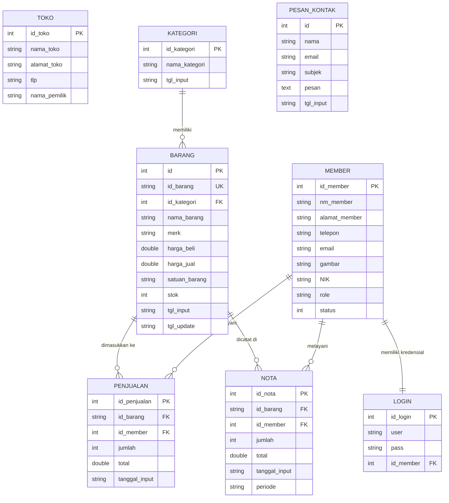

# SMARTKASIR - Premium Glassmorphic POS & Cashier System

SMARTKASIR adalah aplikasi Point of Sales (POS) dan sistem kasir modern yang dirancang dengan antarmuka **Premium Dark Glassmorphism** yang mewah dan interaktif. Aplikasi ini dibangun menggunakan framework **Laravel** untuk manajemen backend admin panel yang aman, dikombinasikan dengan integrasi database kasir relasional.

---

## 🚀 Fitur Utama

1. **Dashboard Statistik Real-time**: Menampilkan total stok barang, jumlah jenis barang terjual, jumlah kategori, serta peringatan otomatis untuk stok barang yang menipis (kritis).
2. **Manajemen Data Master**:
   * **Data Barang**: Menampilkan daftar barang lengkap dengan detail modal beli, harga jual, stok, kategori, satuan, serta aksi penambahan restok cepat, edit detail, dan hapus barang.
   * **Data Kategori**: Penambahan, edit, dan hapus kategori produk secara dinamis.
3. **Point of Sales (POS) / Transaksi Kasir**:
   * Pencarian barang instan menggunakan AJAX (berdasarkan kode atau nama barang).
   * Input keranjang belanja dinamis, edit kuantitas barang langsung di tabel kasir, dan perhitungan otomatis pembayaran beserta kembalian.
   * Cetak bukti pembayaran (nota kasir) dengan layout cetak yang rapi.
4. **Laporan Penjualan & Ekspor Excel**:
   * Filter laporan penjualan fleksibel berdasarkan filter Bulanan maupun filter Harian.
   * Rekap total terjual, total modal, total omset penjualan, serta perhitungan keuntungan bersih secara instan.
   * Ekspor laporan langsung ke Microsoft Excel (.xls) sekali klik.
5. **Manajemen Kasir & Hak Akses (Multi-user)**:
   * Pembedaan hak akses antara **Manajer** (akses penuh) dan **Kasir** (akses terbatas untuk transaksi).
   * Fitur aktivasi & non-aktifkan akun kasir oleh Manajer untuk keamanan akses login.
   * Ganti profil, foto, username, dan password pengguna.

---

## 🛠️ Tech Stack

* **Framework**: [Laravel 11](https://laravel.com/)
* **Database**: MySQL / MariaDB
* **Styling & UI**: Bootstrap 5, Custom CSS (Glassmorphism design, vibrant glow gradients, HSL colors)
* **Library JS**: jQuery, DataTables (with customized premium dark styles), SweetAlert2, FontAwesome 6, AOS (Animate on Scroll)

---

## 📊 Database Schema & ERD

Aplikasi ini menggunakan database relasional dengan relasi antar tabel sebagai berikut. Anda dapat melihat visualisasi diagram ERD di bawah ini:



### Penjelasan Relasi:
1. **`KATEGORI` ke `BARANG`**: Satu kategori dapat memiliki banyak barang (*One-to-Many*).
2. **`MEMBER` ke `LOGIN`**: Setiap kasir/manajer memiliki tepat satu akun login untuk mengakses panel (*One-to-One*).
3. **`MEMBER` ke `PENJUALAN` & `NOTA`**: Setiap transaksi penjualan (baik keranjang sementara maupun nota final) dicatat berdasarkan member kasir yang sedang bertugas (*One-to-Many*).
4. **`BARANG` ke `PENJUALAN` & `NOTA`**: Setiap baris item transaksi merujuk pada kode barang yang terdaftar di sistem (*One-to-Many*).

---

## ⚙️ Cara Instalasi & Menjalankan Project

1. **Clone repository ini**:
   ```bash
   git clone https://github.com/username/repository.git
   cd repository
   ```

2. **Instal dependensi Composer**:
   ```bash
   composer install
   ```

3. **Instal dependensi NPM (jika diperlukan)**:
   ```bash
   npm install && npm run build
   ```

4. **Konfigurasi Environment**:
   Salin file `.env.example` menjadi `.env` lalu sesuaikan kredensial database Anda:
   ```bash
   cp .env.example .env
   ```

5. **Generate Application Key**:
   ```bash
   php artisan key:generate
   ```

6. **Konfigurasi Database**:
   Pastikan Anda telah mengimpor file SQL database bawaan (`kasirdb1.sql`) ke MySQL server Anda melalui phpMyAdmin atau tools database pilihan Anda, lalu hubungkan konfigurasinya pada `.env`:
   ```env
   DB_CONNECTION=mysql
   DB_HOST=127.0.0.1
   DB_PORT=3306
   DB_DATABASE=kasirdb1
   DB_USERNAME=root
   DB_PASSWORD=
   ```

7. **Jalankan Aplikasi**:
   ```bash
   php artisan serve
   ```
   Aplikasi Anda kini dapat diakses melalui link `http://localhost:8000`.
